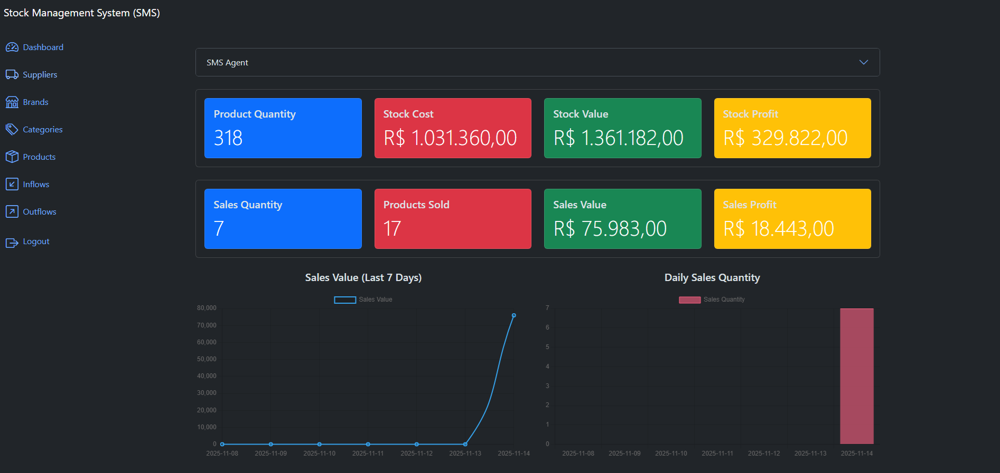
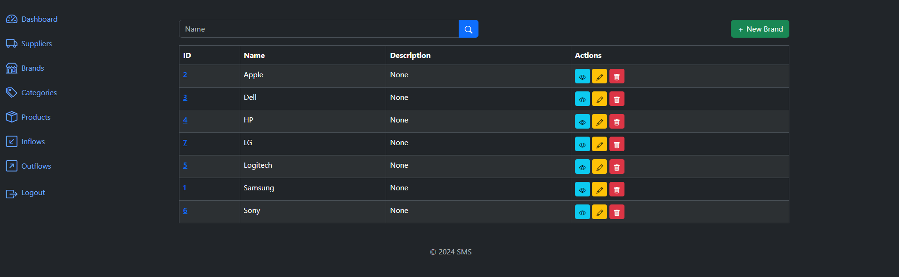
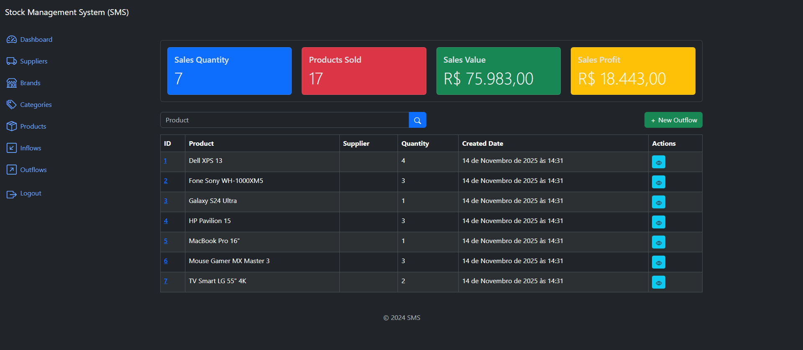

# Stock Management System (SMS)


A comprehensive **Stock Management System** built with Django and Bootstrap 5, featuring AI-powered insights for intelligent inventory management.

## 🚀 Key Features

### 📦 **Core Inventory Management**
- **Complete Product Catalog**: Full CRUD operations for products, brands, suppliers, and categories
- **Real-time Stock Control**: Automated inventory tracking with inflows and outflows management

### 🔍 **Advanced Filtering & Search**
- **Smart Search System**: Multi-parameter filtering by title, serial number, category, and brand
- **Dynamic Filtering**: Interactive filter combinations for precise inventory queries

### 🔐 **Security & Access Control**
- **User Authentication**: Secure login system with session management
- **Role-Based Permissions**: Granular access control for different user types and operations

### 📈 **Analytics Dashboard**
- **Real-time Metrics**: Live inventory analytics with sales performance tracking
- **Interactive Visualizations**: Charts and graphs for sales trends and stock distribution

### 🤖 **AI-Powered Insights**
- **Intelligent Analysis**: OpenAI-powered inventory optimization and recommendations
- **Automated Reports**: AI-generated insights for restock suggestions and sales forecasting
### 🔌 **Integration Ready**
- **API Support**: Built-in Django REST Framework for future integrations
- **Scalable Architecture**: Modular design with Docker support for easy deployment

## 🛠️ Technology Stack

- **Backend**: Django 5.0.1, Python 3.11+
- **Frontend**: Bootstrap 5, Chart.js, Bootstrap Icons
- **Database**: PostgreSQL (with SQLite fallback)
- **AI Integration**: OpenAI GPT-4o-mini
- **Authentication**: Django built-in authentication system
- **Deployment**: Docker & Docker Compose ready

## 📋 Prerequisites

Ensure you have the following installed:

- **Python 3.11+**
- **pip** (Python package manager)
- **PostgreSQL** (for production) or SQLite (for development)
- **Git**

## ⚡ Quick Start

### 1. Clone the Repository
```bash
git clone https://github.com/yagosamu/stock_management_system.git
cd stock_management_system
```

**Or if you're setting up an existing project:**
```bash
git init
git remote add origin https://github.com/yagosamu/stock_management_system.git
git branch -M main
git pull origin main
```

### 2. Create Virtual Environment
```bash
python -m venv venv
source venv/bin/activate  # On Windows: venv\Scripts\activate
```

### 3. Install Dependencies
```bash
pip install -r requirements.txt
```

### 4. Environment Configuration
```bash
cp .env.example .env
# Edit .env file with your configurations
```

### 5. Database Setup
```bash
python manage.py migrate
python manage.py createsuperuser
```

### 6. Run the Development Server
```bash
python manage.py runserver
```

Visit [http://localhost:8000](http://localhost:8000) to access the system.

## 📸 Screenshots

### Dashboard Overview

*Main dashboard showing inventory metrics, sales analytics, and AI-powered insights*

### Brand Management

*Brand management interface with CRUD operations and organized listing*

### Stock Outflows

*Outflow management system tracking all inventory movements and sales*

## 🤖 AI Configuration

To enable AI-powered insights:

1. **Get OpenAI API Key**: Sign up at [OpenAI](https://platform.openai.com/)
2. **Configure Environment**: Add your API key to `.env`:
   ```env
   OPENAI_API_KEY='your-api-key-here'
   OPENAI_MODEL='gpt-4o-mini'
   ```
3. **Generate AI Insights**: Run the AI agent manually:
   ```bash
   python manage.py sge_agent_invoke
   ```

## 🐳 Docker Deployment

### Quick Docker Setup
```bash
docker-compose up -d
```

This will start:
- **Web application** on port 8000
- **PostgreSQL database** on port 5432
- **All required services** automatically configured

## 📊 Usage Examples

### Dashboard Analytics
- View real-time inventory metrics
- Monitor sales performance
- Track stock movements
- Analyze category and brand distribution

### Inventory Operations
- Add new products with detailed specifications
- Record stock inflows from suppliers
- Process outflows and sales
- Generate automated stock reports

### AI Insights
- Receive daily inventory recommendations
- Get restock suggestions based on sales patterns
- Analyze sales trends and forecasts
- Optimize inventory levels automatically

## 🔒 Security Features

- **CSRF Protection**: Built-in Django CSRF protection
- **SQL Injection Prevention**: Django ORM protection
- **Permission-Based Access**: Granular control over user actions
- **Session Security**: Secure session management
- **Input Validation**: Comprehensive data validation

## 🚀 Future Integrations

The system is designed to support:
- **ERP Integration**: Connect with enterprise resource planning systems
- **E-commerce APIs**: Integrate with online selling platforms
- **Barcode Scanning**: Mobile app integration for warehouse operations
- **Automated Purchasing**: AI-driven automatic reorder systems
- **Advanced Analytics**: Machine learning-powered demand forecasting


---

**Built using Django and AI intelligence for modern inventory management.**
